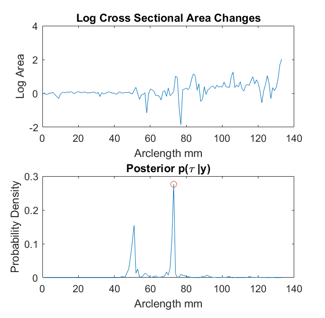

# Modelling Airway Geometry as Stock Market Data using Bayesian Changepoint Detection

[](LICENSE.md)

This repository contains the code for our paper; [Modelling Airway Geometry as Stock Market Data using Bayesian Changepoint Detection](https://arxiv.org/abs/1906.12225)

The code is written by Kin Quan & Michael Duong

## Prerequisites
- Windows
- Matlab R2017b

## Usage

A demonstration of the method can found by running the following script

```
Main_script_for_changepoint_analysis.m
```



## Citation
If you use this code for your research, please cite our paper:
```
@inproceedings{Quan19,
  title={ Modelling Airway Geometry as Stock Market Data using Bayesian Changepoint Detection},
  author={Quan, Kin and Tanno, Ryutaro and Duong, Michael and Nair, Arjun and Shipley, Rebecca and Jones, Mark and Brereton, Christopher and Hurst, John and Hawkes, David and Jacob, Joseph },
  booktitle={Proceedings of the 10th International Workshop on Machine Learning in Medical Imaging (MLMI 2019)}
  year={2019},
}
```

## Keywords
Changepoint Detection, Bayesian Modelling, Abnormality Detection, Reversible Jump Markov Chain Monte Carlo, Metropolis Hastings & Time Series

## Contact
Email: kin.quan.10@ucl.ac.uk

LinkedIn: https://www.linkedin.com/in/kin-quan/

## Acknowledgements

* [Ryutaro Tanno](https://rt416.github.io/) at University College London, UK & Microsoft Research, Cambridge
* Michael Duong at University College London, UK
* [John Hurst](https://twitter.com/ProfHurst) at University College London, UK
* [David Hawkes](https://scholar.google.co.uk/citations?user=XqcO8foAAAAJ&hl=en) at University College London, UK
* [Joseph Jacob](https://iris.ucl.ac.uk/iris/browse/profile?upi=JJACO76) at University College London, UK
